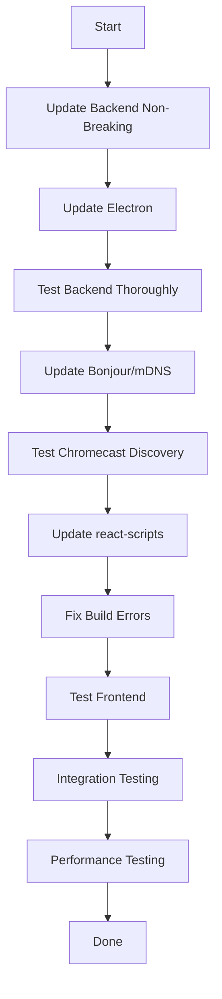

# Dependency Upgrade Plan

This document outlines the plan for upgrading all dependencies with known vulnerabilities (see SECURITY.md).

## Current Status

See `SECURITY.md` for detailed vulnerability report:
- **Backend**: 5 vulnerabilities (1 moderate, 4 high)
- **Frontend**: 9 vulnerabilities (3 moderate, 6 high)

---

## ⚠️ Why Not `npm audit fix --force`?

Running `npm audit fix --force` would apply breaking changes that could break the application:

- **Electron**: 28.0.0 → 39.1.0 (11 major versions!)
- **react-scripts**: 4.x → 5.x (major version change)
- **bonjour**: Breaking API changes

**Result**: App likely won't build or run. Requires extensive testing.

---

## Upgrade Strategy: Phased Approach

### Phase 1: Backend Dependencies (4-6 hours)

#### 1.1 Upgrade Electron (BREAKING CHANGE)

**Current**: 28.0.0
**Target**: 35.7.5+ (or latest stable)
**Breaking Changes**: Yes

**Steps**:
1. Read migration guide: https://www.electronjs.org/docs/latest/breaking-changes
2. Update package.json: `"electron": "^35.7.5"`
3. Run `npm install`
4. Test all Electron features:
   - Window management
   - Menu system
   - IPC communication
   - Auto-updater
   - File system access
   - Native dialogs
5. Update electron-builder if needed
6. Test builds: `npm run dist:mac` and `npm run dist:win`

**Potential Issues**:
- API changes in BrowserWindow
- Changes in app lifecycle events
- IPC protocol changes
- Menu API changes

**Testing Checklist**:
- [ ] App starts successfully
- [ ] Server starts embedded
- [ ] Window opens at correct size
- [ ] Menu items work
- [ ] About dialog shows
- [ ] Logs folder opens
- [ ] App quits cleanly
- [ ] Dev Tools work (if dev mode)

#### 1.2 Update Bonjour/mDNS (BREAKING CHANGE)

**Current**: bonjour 3.5.0
**Target**: bonjour 3.3.0+ OR alternative

**Options**:

**Option A**: Update bonjour
```bash
npm install bonjour@latest
```
- Check if API changed
- Test Chromecast discovery

**Option B**: Switch to alternative
```bash
npm uninstall bonjour
npm install @homebridge/bonjour-hap
# or
npm install dnssd
```

**Required Changes**:
```javascript
// Before
const bonjour = require('bonjour')();

// After (if using @homebridge/bonjour-hap)
const Bonjour = require('@homebridge/bonjour-hap');
const bonjour = new Bonjour();
```

**Testing**:
- [ ] Chromecasts are discovered
- [ ] Multiple Chromecasts detected
- [ ] Discovery works on different networks
- [ ] No memory leaks during long runs

#### 1.3 Update Other Backend Packages

Safe updates (non-breaking):
```bash
npm update express
npm update winston
npm update uuid
npm update multer
npm update cors
npm update ws
```

---

### Phase 2: Frontend Dependencies (6-8 hours)

#### 2.1 Upgrade react-scripts (BREAKING CHANGE)

**Current**: 4.0.3
**Target**: 5.0.1

**Breaking Changes**:
- Webpack 5 (from Webpack 4)
- PostCSS 8
- ESLint 8
- Jest 27
- Browserslist config changes

**Steps**:
1. Read upgrade guide: https://github.com/facebook/create-react-app/blob/main/CHANGELOG.md
2. Update package.json: `"react-scripts": "^5.0.1"`
3. Run `cd client && npm install`
4. Fix breaking changes:
   - Update browserslist in package.json
   - Fix PostCSS config if custom
   - Update Jest config if custom
   - Fix ESLint rules
5. Test build: `npm run build`
6. Test in development: `npm start`
7. Test in Electron: `npm run electron:dev`

**package.json changes needed**:
```json
{
  "browserslist": {
    "production": [
      ">0.2%",
      "not dead",
      "not op_mini all"
    ],
    "development": [
      "last 1 chrome version",
      "last 1 firefox version",
      "last 1 safari version"
    ]
  }
}
```

**Potential Issues**:
- Webpack 5 module federation changes
- PostCSS plugin incompatibilities
- ESLint rule changes
- Build size changes

**Testing Checklist**:
- [ ] `npm run build` succeeds
- [ ] Build output size reasonable
- [ ] App loads in browser
- [ ] All pages render
- [ ] WebSocket connects
- [ ] API calls work
- [ ] No console errors
- [ ] Hot reload works (dev)
- [ ] Production build works in Electron

#### 2.2 Update React & Dependencies

After react-scripts is updated:
```bash
cd client
npm update react react-dom
npm update react-router-dom
npm update lucide-react
```

---

### Phase 3: Testing & Validation (3-4 hours)

#### 3.1 Automated Testing
```bash
# Run existing tests
npm test

# Check for type errors (if using TypeScript/JSDoc)
npm run type-check

# Check for security issues
npm audit

# Check for outdated packages
npm outdated
```

#### 3.2 Manual Testing

**Dashboard Page**:
- [ ] Devices list populates
- [ ] Can select devices
- [ ] Can cast to devices
- [ ] Statistics show correctly

**Slides Page**:
- [ ] Can create all 9 slide types
- [ ] Can edit slides
- [ ] Can delete slides
- [ ] Slide preview works

**Presentations Page**:
- [ ] Can create presentations
- [ ] Can add/remove slides
- [ ] Can reorder slides
- [ ] Can edit durations
- [ ] Can play presentations

**Branding Page**:
- [ ] Can upload logo
- [ ] Can set colors
- [ ] Can add text overlay
- [ ] Preview works
- [ ] Saves correctly

**Logs Page**:
- [ ] Logs display
- [ ] Can filter logs
- [ ] Can download logs
- [ ] Auto-refresh works

**Chromecast Functionality**:
- [ ] Discovers Chromecasts
- [ ] Casts to single device
- [ ] Casts to multiple devices
- [ ] Stops casting
- [ ] Volume control works

#### 3.3 Performance Testing
- [ ] App startup time < 5 seconds
- [ ] Page load time < 2 seconds
- [ ] Memory usage stable
- [ ] No memory leaks after 1 hour
- [ ] WebSocket reconnects properly

---

## Upgrade Order (Recommended)



---

## Rollback Plan

Before each major upgrade:

1. **Create Git Branch**:
```bash
git checkout -b upgrade/electron-35
git commit -am "Before Electron upgrade"
```

2. **Document Current State**:
```bash
npm list > package-list-before.txt
```

3. **If Upgrade Fails**:
```bash
git checkout main
npm install  # Reinstall original packages
```

---

## Alternative: Docker

To avoid "dependency hell", consider Docker:

**Dockerfile**:
```dockerfile
FROM node:18-alpine

WORKDIR /app

# Install dependencies
COPY package*.json ./
RUN npm install

# Copy source
COPY . .

# Build frontend
RUN cd client && npm install && npm run build

# Expose port
EXPOSE 3001

# Start server
CMD ["node", "server/index.js"]
```

**Benefits**:
- Consistent environment
- Easy rollback
- Version pinning
- Isolated dependencies

---

## Estimated Timeline

| Phase | Task | Time | Risk |
|-------|------|------|------|
| 1.1 | Electron upgrade | 3-4 hours | High |
| 1.2 | Bonjour upgrade | 1-2 hours | Medium |
| 1.3 | Other backend | 30 min | Low |
| 2.1 | react-scripts | 4-5 hours | High |
| 2.2 | React deps | 1 hour | Low |
| 3.1 | Automated testing | 1 hour | Low |
| 3.2 | Manual testing | 2 hours | Low |
| 3.3 | Performance testing | 1 hour | Low |
| **Total** | **Full Upgrade** | **14-17 hours** | **Medium-High** |

---

## When to Upgrade?

### Upgrade Now If:
- ✅ Security vulnerability is CRITICAL (CVSS > 8.0)
- ✅ Vulnerability is actively exploited
- ✅ You have 2-3 days for testing
- ✅ App is not in active production use

### Defer Upgrade If:
- ⏸️ App works fine currently
- ⏸️ Only used internally/localhost
- ⏸️ Can't afford downtime for testing
- ⏸️ Planning major refactor anyway

**Current Recommendation**: ⏸️ **Defer to v2.3.0 or v3.0.0**

**Reason**: Current vulnerabilities are:
- Medium severity (not critical)
- Mainly affect dev dependencies
- Limited exposure (localhost only)
- Require 15+ hours of work + testing

---

## Quick Wins (Partial Upgrade)

Instead of full upgrade, do safe updates only:

```bash
# Update non-breaking packages
npm update express
npm update winston
npm update uuid
npm update multer

cd client
npm update lucide-react
npm update
```

**Time**: 30 minutes
**Risk**: Very low
**Benefit**: Some security improvements, no breaking changes

---

## CI/CD Integration

Add to GitHub Actions / GitLab CI:

```yaml
name: Dependency Check
on: [push, pull_request]

jobs:
  audit:
    runs-on: ubuntu-latest
    steps:
      - uses: actions/checkout@v2
      - uses: actions/setup-node@v2
      - run: npm audit
      - run: cd client && npm audit
```

---

## Resources

- **Electron Migration**: https://www.electronjs.org/docs/latest/breaking-changes
- **react-scripts Changelog**: https://github.com/facebook/create-react-app/blob/main/CHANGELOG.md
- **npm audit docs**: https://docs.npmjs.com/cli/v8/commands/npm-audit
- **Renovate Bot**: https://www.mend.io/renovate/ (automated dependency updates)
- **Dependabot**: https://github.com/dependabot (GitHub's dependency updater)

---

**Status**: Plan created, upgrades deferred

**Next Review**: Before v2.3.0 release

**Quick Action**: Run safe updates only (see "Quick Wins" section)
